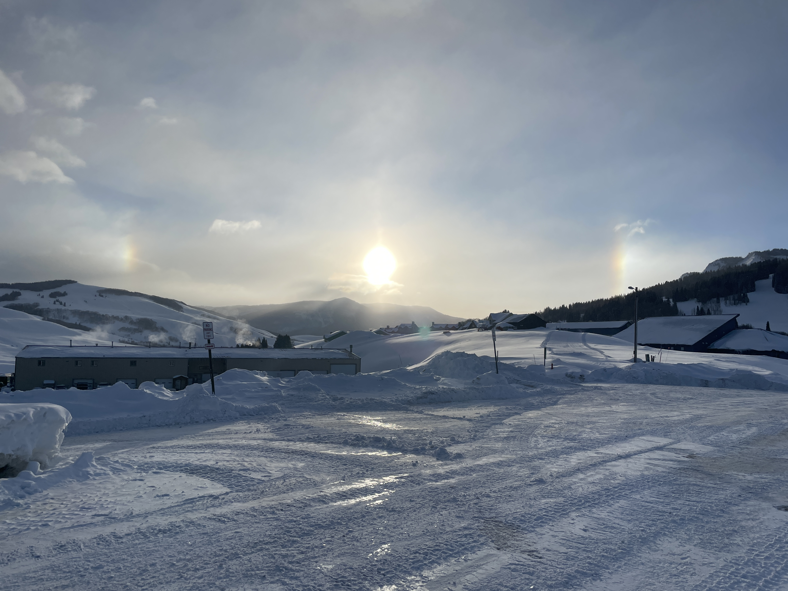

About Me
======
Hi, I'm Danny Hogan. I'm a graduate student at the University of Washington working in the [Mountain Hydrology Research Group](https://depts.washington.edu/mtnhydr/) studying the influences mountain meteorology has on mountain snowpacks and, in turn, on water resources within the Upper Colorado River Basin. I hail from the Bay Area, did my undergraduate degree in envrionmental engineering at Princeton University, rowed competitively in college, worked for 2-years after graduating, and moved up to Washington. I'm now fortunate enough to get to explore the amazing landscapes, weather, and ecosystems we have up here in the PNW with my fiance and dog, Denali!

Academic and Personal Interests
=====
- mountain meteorology
- snow sublimation
- snow surface energy balance/surface energy balance
- snow crystallography
- shoulder seasons
- avalanche risk assessment, prediction & forecasting
- surface hoar/depositional processes
- synoptic meteorology
- water resources in the western US
- water regulation in the western US
- all things endurance sports

Projects
=====
- Sublimation of Snow Campaign
- DOE ESS project

Current and Future Work
======
- Finishing a paper on spring precipitation changes in the Upper Colorado River Basin during the ongoing Millennium Drought and its impact on streamflow
- Preparing a talk for AGU on this subject

Site-wide configuration
------
The main configuration file for the site is in the base directory in [_config.yml](https://github.com/academicpages/academicpages.github.io/blob/master/_config.yml), which defines the content in the sidebars and other site-wide features. You will need to replace the default variables with ones about yourself and your site's github repository. The configuration file for the top menu is in [_data/navigation.yml](https://github.com/academicpages/academicpages.github.io/blob/master/_data/navigation.yml). For example, if you don't have a portfolio or blog posts, you can remove those items from that navigation.yml file to remove them from the header. 

Create content & metadata
------
For site content, there is one markdown file for each type of content, which are stored in directories like _publications, _talks, _posts, _teaching, or _pages. For example, each talk is a markdown file in the [_talks directory](https://github.com/academicpages/academicpages.github.io/tree/master/_talks). At the top of each markdown file is structured data in YAML about the talk, which the theme will parse to do lots of cool stuff. The same structured data about a talk is used to generate the list of talks on the [Talks page](https://academicpages.github.io/talks), each [individual page](https://academicpages.github.io/talks/2012-03-01-talk-1) for specific talks, the talks section for the [CV page](https://academicpages.github.io/cv), and the [map of places you've given a talk](https://academicpages.github.io/talkmap.html) (if you run this [python file](https://github.com/academicpages/academicpages.github.io/blob/master/talkmap.py) or [Jupyter notebook](https://github.com/academicpages/academicpages.github.io/blob/master/talkmap.ipynb), which creates the HTML for the map based on the contents of the _talks directory)