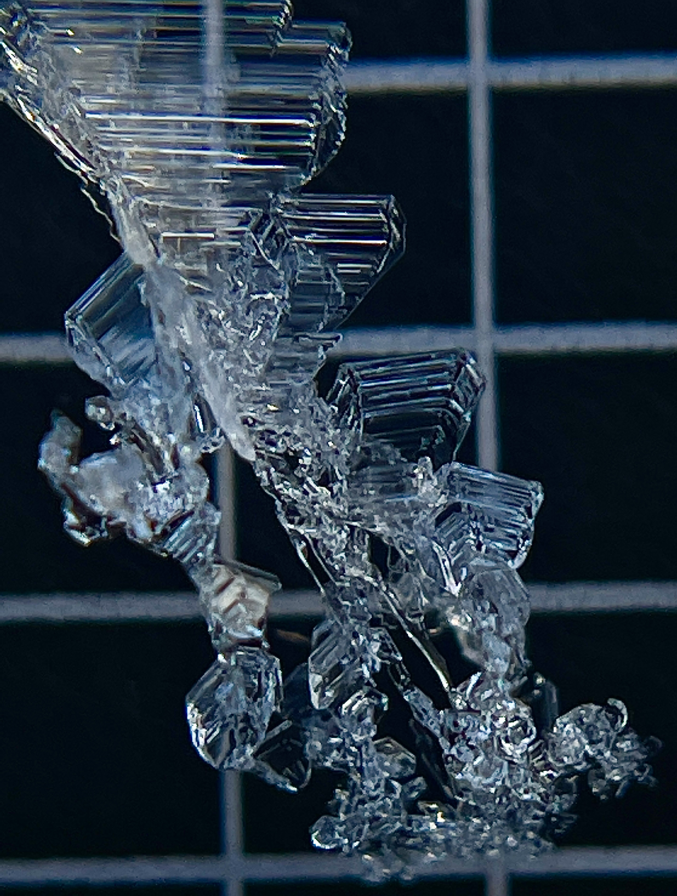

About Me
======
Hi, I'm Danny Hogan. I'm a graduate student at the University of Washington working in the [Mountain Hydrology Research Group](https://depts.washington.edu/mtnhydr/) studying the influences mountain meteorology has on mountain snowpacks and, in turn, on water resources within the Upper Colorado River Basin. I hail from the Bay Area, did my undergraduate degree in envrionmental engineering at Princeton University, rowed competitively in college, worked for 2-years after graduating, and moved up to Washington. I'm now fortunate enough to get to explore the amazing landscapes, weather, and ecosystems we have up here in the PNW with my wife and dog!

  
   
   
   

Academic and Personal Interests
=====
- mountain meteorology, synoptic meteorology
- snow sublimation
- snow surface energy balance
- snow crystallography
- spring/fall season influences
- avalanche risk assessment, prediction & forecasting
- surface hoar/depositional processes
- water resources and regulation in the western US
- all things endurance sports

Projects
=====
- Sublimation of Snow Campaign based in the East River, CO
- DOE ESS project: Mysteries of Missing Mountain Water

  
   

Current and Future Work
======
- Finishing a paper on understanding the synoptic-scale influences on large sublimation events.
- Just completed my General Exam (March 2025)

<!-- Site-wide configuration
------
The main configuration file for the site is in the base directory in [_config.yml](https://github.com/academicpages/academicpages.github.io/blob/master/_config.yml), which defines the content in the sidebars and other site-wide features. You will need to replace the default variables with ones about yourself and your site's github repository. The configuration file for the top menu is in [_data/navigation.yml](https://github.com/academicpages/academicpages.github.io/blob/master/_data/navigation.yml). For example, if you don't have a portfolio or blog posts, you can remove those items from that navigation.yml file to remove them from the header.  -->
