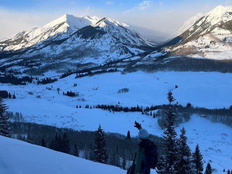

### A brief description with some photos of some efforts. Winter blog to come!

| Name                         | Type                 |  Description                                                                            |
| --------                     | ------               | ------------------------------------------------------------                            |
| [Necklace Valley](#)         |  Trail Run           | A fun out and back up to Tank Lake. Views of Overcoat and Chinmney Peaks and Glaciers.  |
| [LaCrosse Loop](#)           |  Backpack/Trail Run  | A weekend with 28 miles hiking and 26 running. Beatiful, fun exhausting.                |
| [Backcountry Rise 50k](#)    | Trail Race           | Mount Margaret backcountry with insane Mt. St. Helens views. Bit smokay.                |
| [Why-not-Chee](#)            |  Gravel Race         | 78 mile slug-fest out of Lake Wynochee. A grind of a day...                             |
| [Bon Jon Pass out](#)        |  Gravel Race         | 84 mile wet and wild one out of Quilcene. A bit cold for 4500 ft.                       |
| [Gothic Mountain Tour](#)    | Skimo Race           | An awesome first experience in skimo and won the rec category!                          |

 