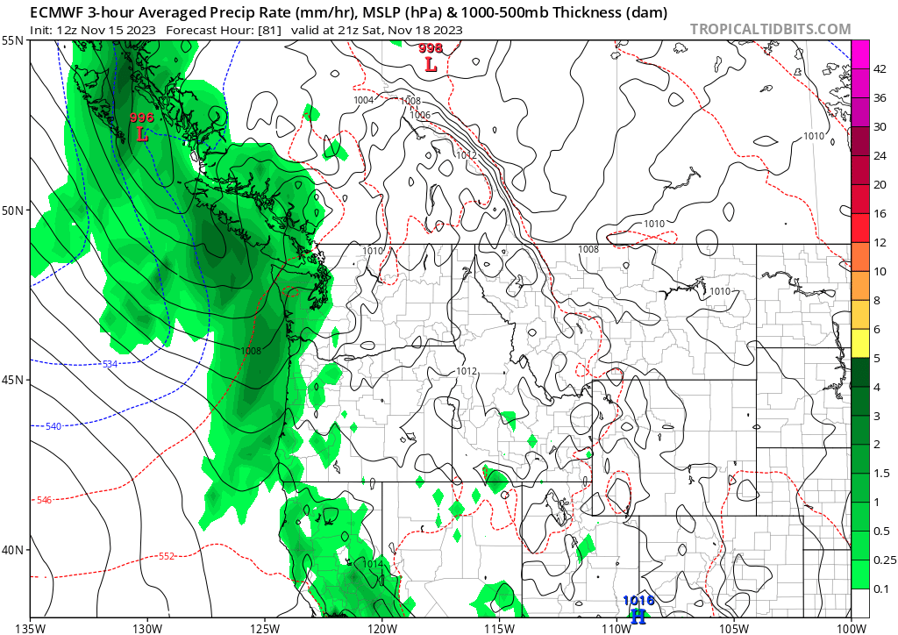
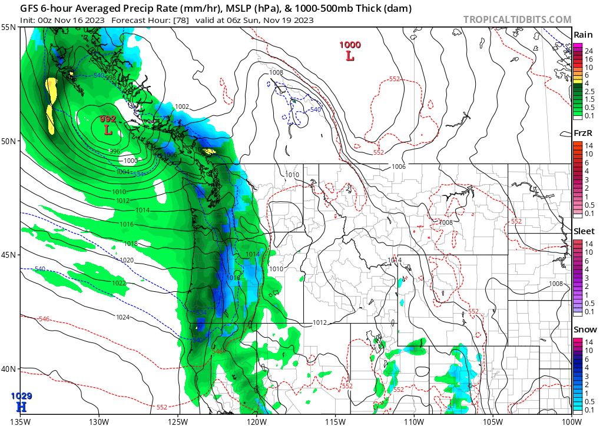

Cool weather returned this week as the PNW sat between a closed low to our south and a passing shortwave that skirted a few of the mountains around the regions. Snow depths are still on the minimal side around or slightly above pass level. We got a decent dousing last weekend with some observations made. This week we have a ridge building into Friday, November 17, with one more day of cooler weather on Thursday. Then, a quickly developing low-pressure system will come into northern Vancouver Island later Saturday into early Sunday. This will bump out our transient ridge that build overhead through Friday. The Euro is a bit more progressive with this system moving through, and a bit lower on precipitation totals compared to the GFS. Cold air filters in behind the front arrival as a ridge fills in looking into next week. Looking generally cool and dry for the start of next week with a cold shot of air looking like it may come through later next week with some snow arriving with it. 

  
  

