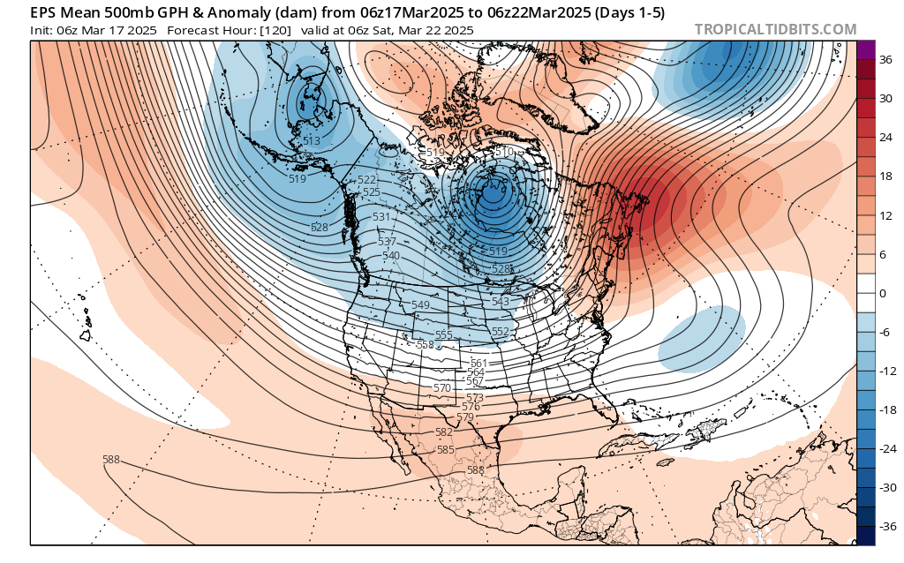
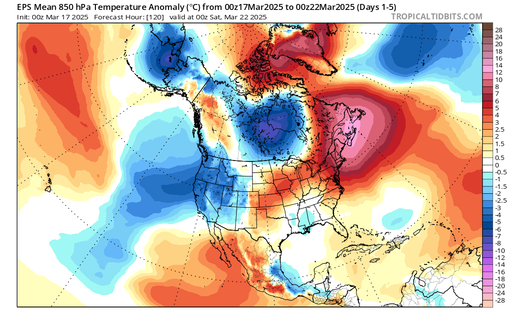
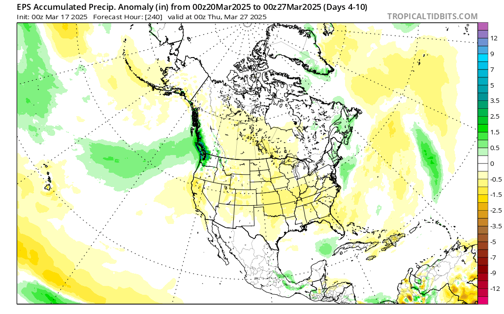
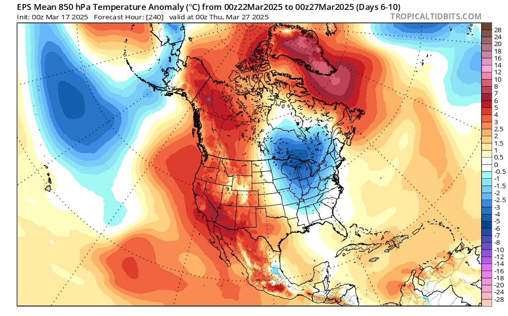

## PNW Synoptic Overview  
**Summary:** A stormy pattern looks to linger with cold air aloft. Sun breaks will be warm things up quickly when they happen, but will be transient. Fun convection and beautiful clouds with lightning potential! Puget Sound convergence zone in play.

<em>Source: <a href="https://www.tropicaltidbits.com">Tropical Tidbits</a></em>

<em>Source: <a href="https://www.tropicaltidbits.com">Tropical Tidbits</a></em>

## Observational Overview  
**Summary:** A shift back to winter may save the snowpack for western Washington and the PNW. The recent cold and snowfall has definitely resuscitated winter, but the low elevation snowpack will continue to suffer as freezing levels creep up with our transition to spring. Volcano season will hopefully be quite long lasting! 

Many people ask me if this poor winter snowpack will make for a bad year for wildfires. With precipitation around 75% of normal, its definitely been a dry year, but the real question will be if we get the right storm setups for wildfires to blow up (read, strong easterly wind events). Without that main ingredient, fires will likely be around normal. 

<iframe 
    src="https://nwcc-apps.sc.egov.usda.gov/imap/#version=169&elements=&networks=!&states=!&basins=!&hucs=&minElevation=&maxElevation=&elementSelectType=any&activeOnly=true&activeForecastPointsOnly=true&hucLabels=false&hucIdLabels=false&hucParameterLabels=true&stationLabels=&overlays=&hucOverlays=&basinOpacity=75&basinNoDataOpacity=25&basemapOpacity=100&maskOpacity=0&mode=data&openSections=dataElement,parameter,date,basin,options,elements,location,networks&controlsOpen=true&popup=&popupMulti=&popupBasin=&base=esriNgwm&displayType=basin&basinType=8&dataElement=WTEQ&depth=-8&parameter=PCTMED&frequency=DAILY&duration=I&customDuration=&dayPart=E&monthPart=E&forecastPubDay=1&forecastExceedance=50&useMixedPast=true&seqColor=1&divColor=7&scaleType=D&scaleMin=&scaleMax=&referencePeriodType=POR&referenceBegin=1991&referenceEnd=2020&minimumYears=20&hucAssociations=true&relativeDate=-1&lat=45.611&lon=-119.988&zoom=6.5&autoExport=full,pdf,2,0,L,BL,,49.8415,42.2913,-113.5327,-126.708,0.6" 
    width="100%" 
    height="600px" 
    style="border: none;">
</iframe>

## Dry/Wet, Warm/Cool Signals for the Coming Week  
**Summary:** Forecast for the Snoqualamie basin for CW3E shows a freezing level right aroung 3000' for the week, but then shooting up early next week as confidence for an AR-like feature is building.

<em>Source: <a href="https://cw3e.ucsd.edu/DSMaps/DS_freezing.html">CW3E</a></em>

<em>Source: <a href="https://cw3e.ucsd.edu/DSMaps/DS_freezing.html">CW3E</a></em>

## Forecast Uncertainty  
**Summary:** Still substantial uncertainty on the trajectory and strength of this AR, but should keep an eye on the setup to warm things up substantially, but keep things wet  

<em>Source: <a href="https://cw3e.ucsd.edu/DSMaps/DS_ar_forecasts.html">CW3E</a></em>

<em>Source: <a href="https://cw3e.ucsd.edu/arscale/">CW3E</a></em>

<em>Source: <a href="https://www.tropicaltidbits.com">Tropical Tidbits</a></em>

<em>Source: <a href="https://www.tropicaltidbits.com">Tropical Tidbits</a></em>

---

Stay tuned for next week's update!  
